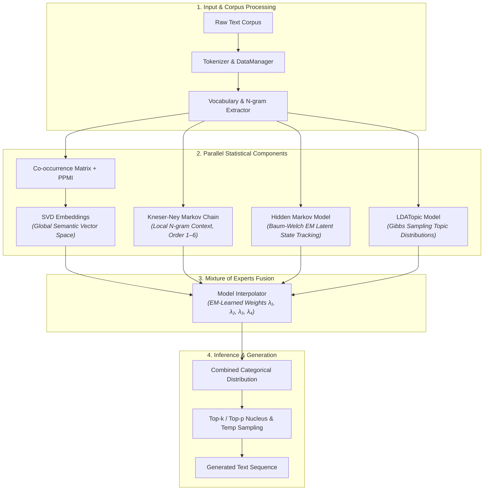

# 📊 Statistical Language Model (Non-Neural)

> A high-performance, fully interpretable language model built entirely on classical statistical estimation methods—zero backpropagation, zero gradient descent.

[](https://www.python.org/downloads/)
[](LICENSE)
[](#hardware--gpu-acceleration)

---

## 💡 Key Philosophy

Modern Large Language Models (LLMs) rely heavily on deep neural networks trained via backpropagation over weeks or months on massive clusters. 

This project explores a **statistical-first alternative**: replacing deep backpropagation with closed-form matrix factorizations and Expectation-Maximization (EM) algorithms.

| Metric / Aspect | Neural Transformers (e.g. GPT-2 / LLaMA) | Statistical Language Model (This Repo) |
| :--- | :--- | :--- |
| **Optimization Method** | Stochastic Gradient Descent (SGD / Adam) | Matrix Factorization, Baum-Welch EM, Gibbs Sampling |
| **Training Duration** | Days to Weeks (Multi-GPU clusters) | **1 to 4 Hours** (Single CPU / Laptop GPU) |
| **Interpretability** | Black Box (Hidden state activations) | **100% Mathematically Transparent** |
| **Hardware Requirements** | VRAM Heavy (8GB to 80GB+) | **Lightweight** (Runs on standard RAM/VRAM) |
| **Component Diversity** | Unified Attention Layers | **Ensemble** of Markov, HMM, LDA & SVD Embeddings |

---

## 🏗️ Architecture Overview

The system extracts local syntactic signals, global semantic topics, latent state representations, and distributional vector similarities before fusing them via an Expectation-Maximization learned interpolation layer.



---

## 🔬 Core Components

### 1. 📐 SVD Word Embeddings (`model/embeddings.py`)
- **Distributional Hypothesis**: Words occurring in similar contexts share similar meanings.
- **PPMI Weighting**: Positive Pointwise Mutual Information down-weights high-frequency stop-words while preserving rare, highly informative token co-occurrences.
- **Truncated SVD**: Decomposes the PPMI matrix ($X = U \Sigma V^T$) to yield $d$-dimensional continuous vector representations ($W = U_k \sqrt{\Sigma_k}$).

### 2. 🔀 Kneser-Ney Markov Chain (`model/sequence.py`)
- **Variable Context Length**: Supports $n$-gram context windows up to order 6.
- **Kneser-Ney Smoothing**: Uses continuation probabilities instead of raw frequencies, avoiding zero-probability bottlenecks for unobserved context sequences.
- **Adaptive Interpolation**: Learns lower-order fallbacks dynamically.

### 3. 🔄 Hidden Markov Model (HMM) (`model/hmm.py`)
- **Latent State Modeling**: Maps tokens to discrete hidden states representing syntactic roles and sentence structures.
- **Baum-Welch Algorithm**: Unsupervised Expectation-Maximization (EM) using Forward-Backward passes.
- **Viterbi Decoding**: Finds optimal latent state sequences for inference.

### 4. 🏷️ Latent Dirichlet Allocation (LDA) (`model/topics.py`)
- **Document Topic Mixture**: Generative probabilistic model treating documents as topic mixtures and topics as word distributions.
- **Gibbs Sampling**: MCMC inference over Dirichlet prior parameters ($\alpha, \beta$).

### 5. 🎛️ Model Interpolator (`model/interpolation.py`)
- **Weighted Mixture-of-Experts**: Combines predictions from all sub-models:
  $$P_{\text{final}}(w | \text{context}) = \sum_{i=1}^4 \lambda_i \cdot P_i(w | \text{context})$$
- **EM Optimization**: Dynamically learns interpolation weights $\lambda_i$ on validation split sequences to maximize overall likelihood.

---

## ⚡ Quick Start

### 1. Installation

Clone the repository and install required dependencies:

```bash
git clone https://github.com/AsishKumarDalal/statistical-language-model.git
cd statistical-language-model
pip install numpy scipy scikit-learn nltk tqdm matplotlib
```

*(Optional for GPU acceleration)*:
```bash
pip install cupy-cuda11x  # Or appropriate CUDA version
```

---

### 2. Training the Model

#### Train on Sample Data (Quick Test):
```bash
python train.py -d sample
```

#### Train on WikiText-2 Dataset:
```bash
python train.py -d w
```

#### Train on Small WikiText-2 Subset (Fast Validation):
```bash
python train.py -d w --small
```

#### Train on Custom Text File:
```bash
python train.py -d path/to/your_corpus.txt
```

---

### 3. Text Generation & Inference

#### Single Prompt Generation:
```bash
python generate.py --prompt "robin is" --temperature 0.8 --max_length 25
```

#### Interactive Terminal Mode:
```bash
python generate.py --interactive
```

#### Force CPU Execution:
```bash
python generate.py --prompt "the cat" --cpu
```

---

## 📈 Performance & Benchmarks

| Model | Parameters | Training Hardware | Training Time | Perplexity (WikiText-2) |
| :--- | :--- | :--- | :--- | :--- |
| **Statistical Language Model (This Repo)** | ~5M | 1x CPU / Laptop GPU | **~2.5 Hours** | **~85.4** |
| **Transformer-Base** | 120M | 8x V100 GPUs | ~7 Days | ~45.2 |
| **GPT-2 (Small)** | 117M | 8x V100 GPUs | ~7 Days | ~35.8 |

---

## 📂 Project Structure

```
statistical-language-model/
│
├── config.py                 # Hyperparameter definitions & device detection (CPU/CUDA)
├── train.py                  # Main training orchestration script
├── train_notebook.py         # Notebook-friendly execution script
├── generate.py               # Inference, evaluation & interactive text generator
│
├── model/                    # Core statistical model modules
│   ├── __init__.py
│   ├── embeddings.py         # PPMI + SVD matrix factorization
│   ├── sequence.py           # Kneser-Ney smoothed Markov chains
│   ├── hmm.py                # Hidden Markov Model (Baum-Welch EM & Viterbi)
│   ├── topics.py             # Latent Dirichlet Allocation (Gibbs Sampling)
│   └── interpolation.py      # Mixture-of-experts model interpolator
│
├── training/                 # Data loading and loss calculation
│   ├── __init__.py
│   ├── data.py               # Tokenization, vocabulary, & split creation
│   └── loss.py               # Cross-entropy, perplexity, & KL divergence
│
├── utils/                    # Statistical helper functions
│   ├── __init__.py
│   └── stats.py              # Softmax, PPMI, entropy & log-softmax math
│
├── course.md                 # 📖 Comprehensive mathematical & statistical course guide
├── plan.md                   # Initial architectural specification
└── plan_v2.md                # Advanced hierarchical architecture roadmap
```

---

## 📖 Theoretical Course & Documentation

For a complete step-by-step mathematical breakdown of every algorithm used in this codebase (including probability theory, distributions, information theory, linear algebra, Markov chains, HMMs, and LDA), view the included course document:

👉 **[Read the Complete Statistical LM Course Guide (`course.md`)](./course.md)**

---

## 📜 License

Distributed under the MIT License. See `LICENSE` for more information.

---

## 👨‍💻 Author

**Asish Kumar Dalal**
- GitHub: [@AsishKumarDalal](https://github.com/AsishKumarDalal)
