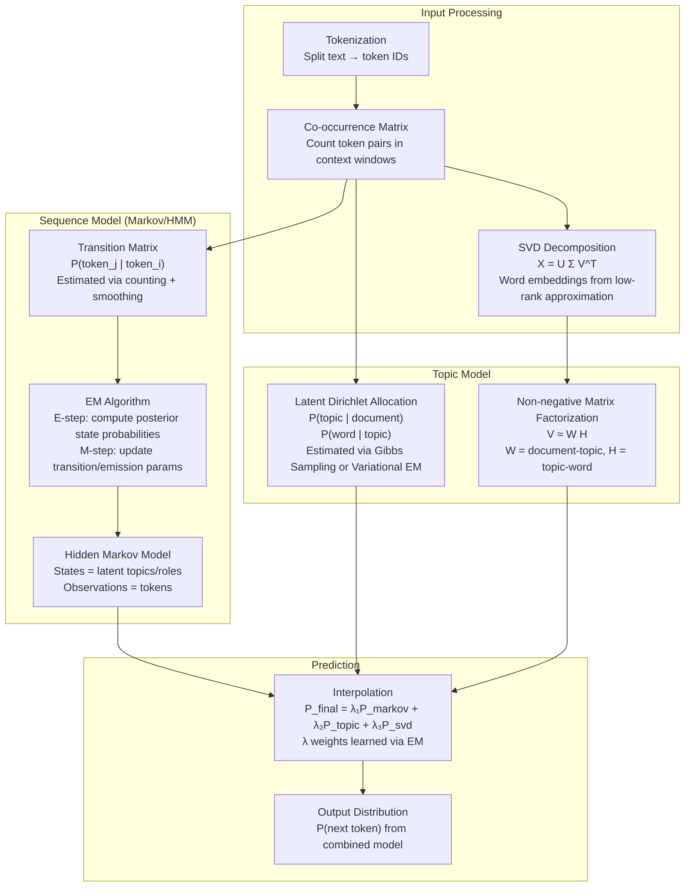

# Statistical Language Model — No Neural Networks

## Core Idea

Replace backpropagation + gradient descent with **statistical estimation methods** that converge in hours, not weeks.

| Aspect | Neural Transformer | This Model |
|--------|-------------------|------------|
| Training | Backprop (weeks) | EM / closed-form (hours) |
| Optimization | SGD/Adam (millions of steps) | Matrix factorization / EM (hundreds of iterations) |
| Representation | Learned embeddings via gradient | SVD on co-occurrence (one pass) |
| Sequence modeling | Self-attention via backprop | HMM / Markov chain via EM |
| Parameters | Billions of floats | Thousands to millions |
| Hardware | Multi-GPU cluster | Single CPU/GPU |

---

## Architecture Overview

