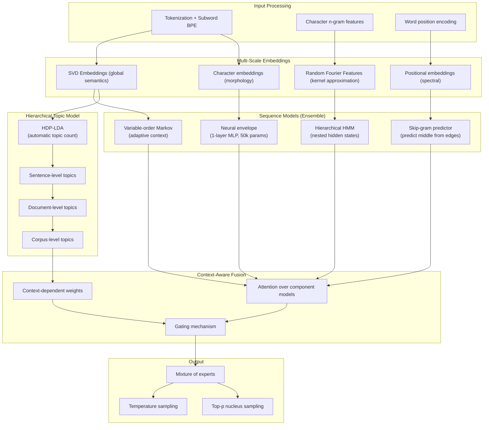

# Statistical Language Model v2 — Enhanced Architecture

## Architecture Overview

```mermaid
flowchart TD
    subgraph INPUT["Input Processing"]
        A1["Tokenization + Subword BPE"]
        A2["Character n-gram features"]
        A3["Word position encoding"]
    end

    subgraph EMBEDDINGS["Multi-Scale Embeddings"]
        B1["SVD Embeddings (global semantics)"]
        B2["Random Fourier Features (kernel approximation)"]
        B3["Positional embeddings (spectral)"]
        B4["Character embeddings (morphology)"]
    end

    subgraph SEQUENCE["Sequence Models (Ensemble)"]
        C1["Variable-order Markov<br/>(adaptive context)"]
        C2["Hierarchical HMM<br/>(nested hidden states)"]
        C3["Skip-gram predictor<br/>(predict middle from edges)"]
        C4["Neural envelope<br/>(1-layer MLP, 50k params)"]
    end

    subgraph TOPIC["Hierarchical Topic Model"]
        D1["HDP-LDA<br/>(automatic topic count)"]
        D2["Sentence-level topics"]
        D3["Document-level topics"]
        D4["Corpus-level topics"]
    end

    subgraph CONTEXT["Context-Aware Fusion"]
        E1["Attention over component models"]
        E2["Context-dependent weights"]
        E3["Gating mechanism"]
    end

    subgraph OUTPUT["Output"]
        F1["Mixture of experts"]
        F2["Temperature sampling"]
        F3["Top-p nucleus sampling"]
    end

    A1 --> B1
    A2 --> B2
    A3 --> B3
    A1 --> B4

    B1 --> C1
    B2 --> C2
    B3 --> C3
    B4 --> C4

    C1 --> E1
    C2 --> E1
    C3 --> E1
    C4 --> E1

    B1 --> D1
    D1 --> D2
    D2 --> D3
    D3 --> D4

    D4 --> E2
    E1 --> E3
    E2 --> E3
    E3 --> F1
    F1 --> F2
    F1 --> F3
```
